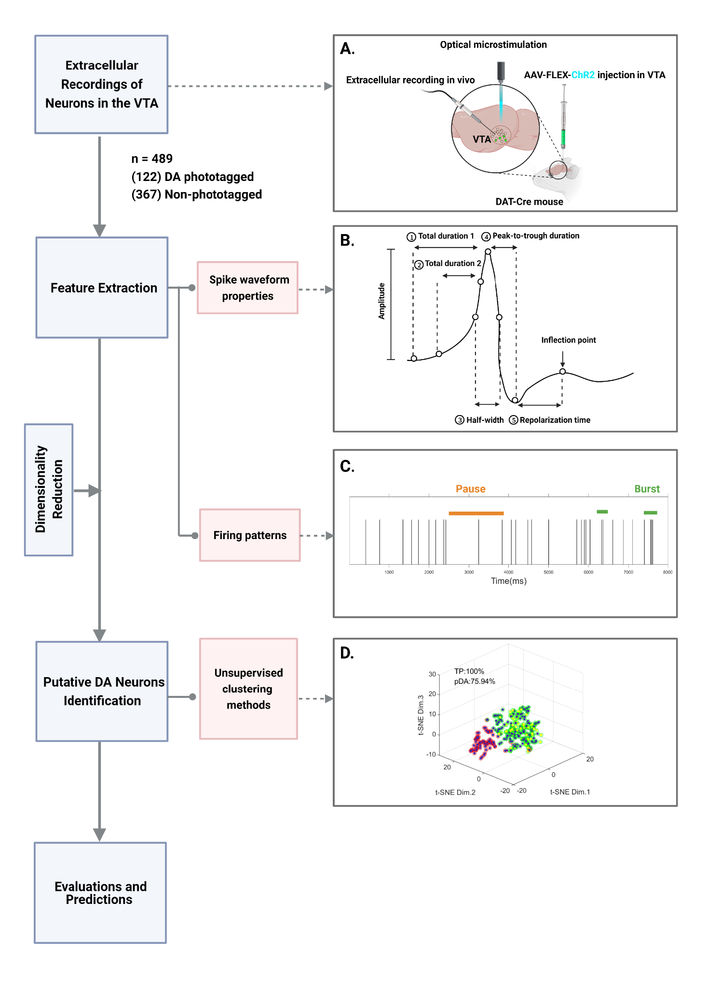

# Unsupervised Clustering for Putative Dopamine Neuron Identification from Tetrode Recordings

This repository contains MATLAB scripts and functions designed for unsupervised clustering of large-scale dopamine neurons based on their electrophysiological properties extracted from time-series tetrode recordings. A downstream linear SVM uses the cluster structure for out-of-sample predictions. The code includes reproducible pipelines for feature tables, clustering, visualization, and evaluation. The primary focus is to differentiate putative dopamine (pDA) neurons from non-dopamine neurons by extracting key time-series features and applying clustering techniques.

## Workflow

The sketch of the workflow contains five main steps: extracellular recordings of neurons in the VTA, feature extraction, dimensionality reduction, putative DA (pDA) neurons identification by unsupervised clustering methods, and model evaluations and predictions.
(A) The VTA of male DAT-Cre mice were injected with Cre-dependent AAV virus expressing ChR2. Pulses of light were delivered to activate ChR2-expressing neurons after a virtual-reality reward delivery task.
(B) Five spike waveform properties.
(C) The spike trains from an exmaple neuron. Orange and green horizontal bars represent pause and busrt respectively.
(D) An exmaple 3D t-SNE scatter plot for extracellularly recorded neurons in the VTA. For unsupervised clustering under best performance, set circular borders on them according to their membership (non-pDA, red borders; pDA, green borders) determined by a specific unsupervised clustering.

### 1. Feature extraction

(A) Total duration 1 and Total duration 2 extracted from 8 example neurons. The time courses of spike waveform amplitude from each neuron (blue line). Total duration 1 is the distance between green dotted lines, while Total duration 2 is the distance between pink dotted lines.
(B) Half-width extracted from 8 example neurons. Half-width is the duration between pink dotted lines.
(C) Peak-to-trough duration and repolarization time extracted from 8 example neurons. The red, blue, and green points in each subplot correspond to peak, trough, and inflection points respectively. Peak-to-trough duration represents the distance between peak and trough, while repolarization time is the distance between trough and inflection point.
(D) Normalized log inter-spike intervals (ISIs) of a representative neuron in the VTA. Two dark vertical lines define the burst and pause thresholds. Different shades of blue represent pause, tonic and burst respectively.

### 2. Principal component analysis for dimensionality reduction and t-SNE

(A) Variance explained by principal components (PCs). 38 PCs explain 99.3% variances of the training dataset.
(B) 3D scatter plot of the first three PCs showing the clustering of phototagged DA neurons (yellow points; n= 80) and non-phototagged neurons (blue points; n =240).
(C) 2D t-SNE scatter plot with PCA initialization.

### 3. Unsupervised clustering of extracellularly recorded neurons in the VTA
<table>
<tr>
<td width="50%">
  
</td>
<td width="50%">
  (A–E) 3D t-SNE scatter plot for extracellularly recorded neurons in the VTA
  (phototagged DA 30 neurons, yellow, n=80; non-phototagged neurons, dark blue, n=240).  
  For unsupervised clustering under best performance, set circular borders on them according
  to their membership (non-pDA, red borders; pDA, green borders) determined by k-means,
  DBSCAN, k-medoids, GMM, and OCSVM.  
  True positive rate (TP) (%) and the proportion of putative DA neurons among all recorded
  neurons (%) were calculated in each clustering model.  

  (F) TP (%) of various unsupervised clustering methods. Each method for 100 times.  
  (G) Proportion of putative DA neurons of various unsupervised clustering methods. Each
  method for 100 times. Box plots indicate the median (red center line), first quartiles
  (the bottom and top edges), minimum/maximum values (whiskers), and outliers (red +).
</td>
</tr>
</table>

<table>
<tr>
<td width="50%">
  
</td>
<td width="50%">
   Evaluation of k-means and GMM
   (A) TP (%) and pDA (%) across different sample sizes ranging from 19 to 489 based on k-means clustering. Plotted in mean ± S.D.
   (B) TP (%) and pDA (%) across different sample sizes ranging from 19 to 489 based on k-means clustering. Plotted in mean ± S.D.
   (C) The Calinski-Harabasz index with varying clusters in k-means. The best number if cluster is marked by a filled blue point.
   (D) The Calinski-Harabasz index with varying clusters in GMM. The best number if cluster is marked by a filled blue point.
</td>
</tr>
</table>

### 4. Validation: k-means clustering of extracellular waveforms and firing patterns from pDA and non-pDA clusters
 
(A) Normalized waveforms for units from pDA (green) and non-pDA (red) clusters (n=243 in the pDA cluster; n = 77 in the non-pDA cluster).
(B) Normalized log inter-spike intervals (ISIs) of representative neurons from the pDA cluster and the non-pDA cluster. Two thresholds define the burst and pause thresholds.
(C-F) Scatter plot with histograms for firing rates versus spike waveform properties of clustered neurons. Each data point represents a neuron. The baseline firing rate is plotted in the ordinate, spike width, peak-to-trough duration, repolarization time and total duration are plotted in the abscissa.

### 5. Prediction: The Clustering Structure in K-means Model could Predict pDA Neurons in the Testing Dataset
 
Prediction models using labels obtained from k-means clustering
(A) Euclidean distance clustering predictions for recorded neurons from the testing dataset (n=169).
(B) Clustering predictions generated from a linear SVM for recorded neurons from the testing dataset (n=169).

## Repository Contents

### Scripts and Functions

- **King_2.m**: Main script that calls various functions to preprocess the raw dataset and extract features.
- **RGSDetect.m**: Function to detect bursts and pauses in neuron firing.
- **ComputeCL.m**: Sub-function within `RGSDetect.m` to calculate additional metrics.
- **plot_ptt_new.m**: Computes peak-to-trough and repolarization time for action potentials.
- **plot_ptt_2.m**: Plots peak-to-trough and repolarization time.
- **plot_td_2.m**: Calculates the total duration of action potentials.
- **Rasterplot.m**: Plots all spikes along a time scale.
- **Clustering.m**: Main script for normalizing features, reducing dimensionality, and performing unsupervised clustering.
- **Clustering_plotting.m**: Plots the clustering results for analysis and visualization.
- **feature_table.m**: Generates a table with 38 extracted features.
- **test_stable.m**: Tests the stability of different clustering methods.

### Feature Table and Structure

The feature table consists of 58 features and a label that marks each neuron as photo-tagged (1) or non-identified (-1). The table includes:
- **Electrophysiological Features**: Peak-to-trough duration, repolarization time, total duration (at 80% amplitude), half-width, etc.
- **Burst Features**: 26 features related to bursts (mean, median, standard deviation, skewness, kurtosis, etc.).
- **Pause Features**: 26 features related to pauses.
- **Tonic Features**: Overall firing rates or other baseline characteristics.

### Data Processing and Clustering Workflow

1. **Preprocessing and Feature Extraction**:
   - Run `King_2.m` to preprocess the dataset and extract electrophysiological properties from tetrode recordings of ventral tegmental area (VTA) neurons.
   - Features extracted include waveform properties and firing patterns such as bursts and pauses.
   - Conducted Principal Component Analysis (PCA) to reduce the original 58 features to 38 principal components, retaining 99% of the variance.

2. **Clustering and Classification**:
   - Use `Clustering.m` to test various unsupervised clustering methods, including k-means, k-medoids, Gaussian Mixture Model (GMM), and DBSCAN, to identify additional putative dopamine (pDA) neurons that may have been missed by the opto-tagging technique.
   - After clustering, utilize `Clustering_plotting.m` to visualize the results and evaluate the clustering performance.
   - Trained a linear Support Vector Machine (SVM) classifier using the labels generated by the k-means clustering results, achieving a true positive rate of 95% and identifying 78% of pDA neurons in the testing dataset.

### FIGURE

The primary FIGURE includes comprehensive details about each neuron:
1. Cell name and identifiers.
2. Electrophysiological properties such as waveform and peak-to-trough duration.
3. Burst and pause characteristics, including:
   - Burst features: Mean, median, standard deviation, skewness, and kurtosis.
   - Pause features: Similar statistical measures.
4. Other details like repolarization time, total duration, half-width, tonic features, and whether the neuron is photo-identified.

### Table Structure (table_raw.m)

- **table_raw.m** saves the feature table along with training and testing samples for clustering.
- `{1,1}`: Contains a feature table with 37 features.
- `{2,1}`: Contains a feature table with 58 features.

### Features in the Table

1. `data_ttp`: Trough-to-peak duration (ms)
2. `data_rt`: Repolarization time (ms)
3. `td1s`: Total duration (ms)
4. `td2s`: Total duration at 80% amplitude (ms)
5. `hws`: Half-width (ms)
6-31. Burst features (26 metrics)
32-57. Pause features (26 metrics)
58. Tonic features
59. Mark (1 for photo-tagged, -1 for non-identified)

---

This project provides a robust framework for unsupervised clustering and characterization of neuron types based on electrophysiological data. Each function and script plays a specific role in the data processing pipeline, from feature extraction to clustering and visualization.

**************************************************************************************
## FIGURE: Main Cell Information

Each cell in the analysis contains the following attributes:

1. **Cell Names**: Unique identifier for each neuron.
2. **DAN.unref_avg_WF**: Average waveform of the neuron.
3. **DAN.best_unref_channel**: Name of the best channel for the neuron.
4. **Signals from the Best Channel**: Electrophysiological signals from the best channel.
5. **Photoidentified or Non-photoidentified**: Indicates if the neuron was photoidentified.
6. **Order of the Cell**: Sequence or order number in the dataset.
7. **Repolarization Time**: Time for the neuron to repolarize after an action potential.
8. **Total Duration 1**: Full duration of the action potential.
9. **Total Duration 2 (80% Amplitude)**: Duration at 80% of the action potential’s amplitude.
10. **Half-width**: Width of the action potential at half its maximum amplitude.
11. **Input Time Scale in Figure**: Time scale used in plotting.
12. **(Reserved for future use)**

### Additional Calculations and Features

13. **ptt (Peak-to-Trough Duration)**: Time between the peak and trough of the action potential.
14. **Bursts**: High-frequency spike groups within short intervals.
15. **Pauses**: Low-frequency spike groups within long intervals.
16. **Bursts Features**: Includes mean, median, standard deviation, skewness, and kurtosis of burst data matrix.
    - Matrix: `[Bursts_windows(s), Bursts_IBFs (Hz), Bursts_NumSpikes]`
17. **Percentage of Burst Windows** (`per_Bursts_windows`): Fraction of time in burst mode.
18. **Pauses Features**: Includes mean, median, standard deviation, skewness, and kurtosis of pause data matrix.
19. **Percentage of Pause Windows** (`per_Pauses_windows`): Fraction of time in pause mode.
20. **Bursts** (repeated): Additional computation of burst features.
21. **Pauses** (repeated): Additional computation of pause features.
22. **Bursts** (repeated for further calculations).
23. **Pauses** (repeated for further calculations).
24. **Tonics**: Characteristics of tonic firing outside of bursts and pauses.
25. **Burst Characteristics**: `[per_Bursts_windows, Bursts_ISIfeature', Bursts_spikefeature']`
26. **Pause Characteristics**: `[per_Pauses_windows, Pauses_ISIfeature', Pauses_spikefeature']`
27. **Percentage of Tonic Windows** (`per_Tonics_windows`): Fraction of time in tonic mode.
